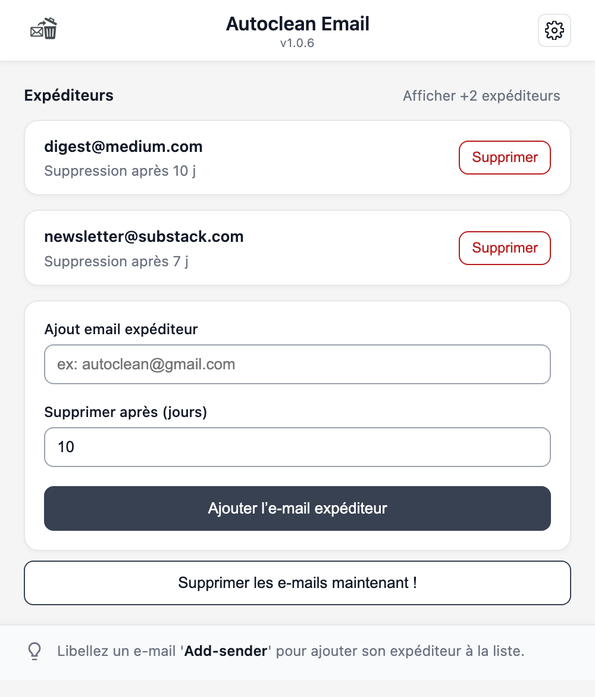
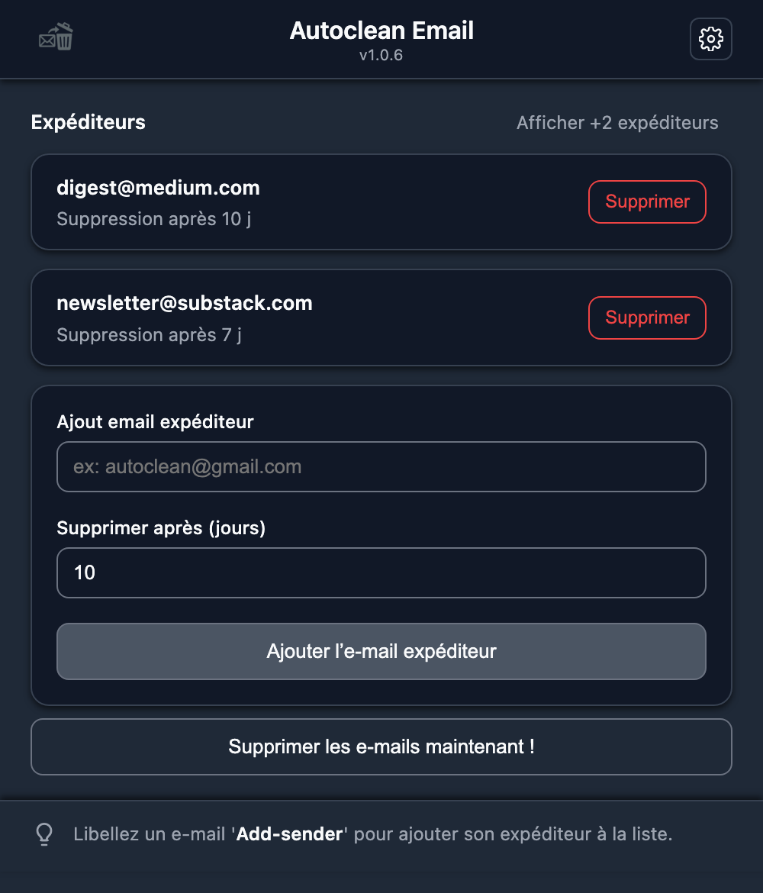
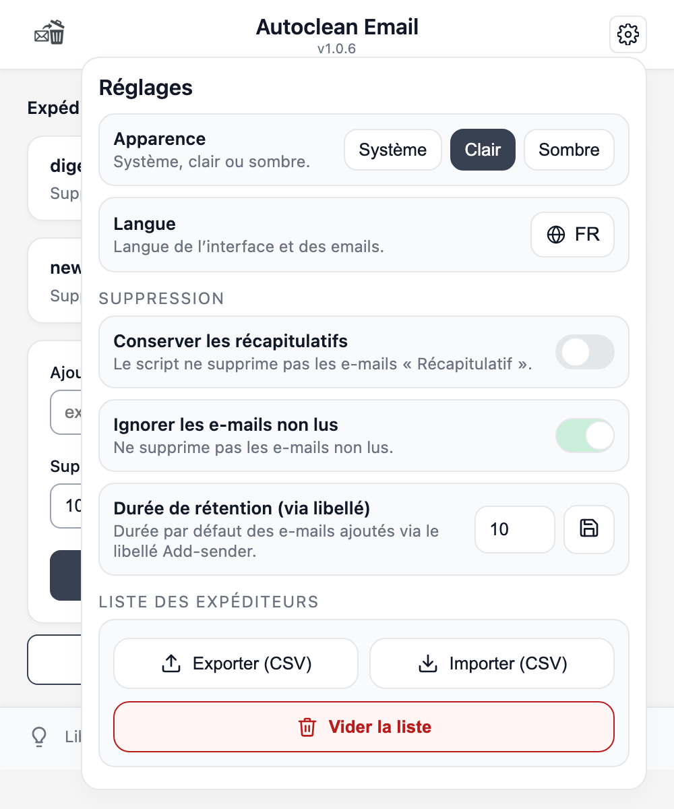

# Autoclean Email

> **Version 1.0.6** · Chrome Extension (Manifest V3) + Google Apps Script backend.

[](https://chromewebstore.google.com/detail/autoclean-email/jnmgdnpefiajjojodnpfoclkohnckpne)
[](LICENSE)

**▶️ Install from the Chrome Web Store:** <https://chromewebstore.google.com/detail/autoclean-email/jnmgdnpefiajjojodnpfoclkohnckpne?hl=fr>

Automated Gmail cleanup with **per-sender retention rules** and scheduled runs.
Emails older than the retention period you set for each sender are moved to Trash —
either on demand or on a schedule.

The extension never deletes emails through a third-party server: it drives a
**Google Apps Script Web App** that you deploy on **your own Google account**, so
the actual Gmail operations run entirely inside your environment.

---

## 🇫🇷 En bref

**Autoclean Email** est une extension Chrome (Manifest V3) qui automatise le nettoyage
de Gmail selon une **règle de rétention par expéditeur** (nombre de jours à conserver).
Le nettoyage est exécuté par un **Google Apps Script** déployé sur **votre propre compte
Google** — aucune donnée n'est envoyée à un serveur tiers.

- 🔒 *Privacy by design* : les règles vivent dans vos `ScriptProperties`, l'extension ne
  demande pas de scope Gmail direct (OAuth minimal `userinfo.email`).
- 🌍 Interface et e-mails récapitulatifs bilingues **FR / EN**.
- ⏱️ Nettoyage manuel (bouton, limité à 1×/min) ou planifié (déclencheur Apps Script).

**▶️ Installer depuis le Chrome Web Store :** <https://chromewebstore.google.com/detail/autoclean-email/jnmgdnpefiajjojodnpfoclkohnckpne?hl=fr>

---

## 📸 Screenshots

| Main popup | Dark mode | Settings |
|:---:|:---:|:---:|
|  |  |  |

---

## 📁 Repository structure

```
.
├── extension/        # Chrome extension (Manifest V3) — this folder IS the unpacked extension
│   ├── manifest.json
│   ├── popup.html / popup.js        # main UI
│   ├── config.html / config.js      # installation guide + Web App URL entry
│   ├── background.js                # service worker (CSV import / batch add)
│   ├── api.js / auth.js / settings.js / i18n.js
│   ├── Code.gs                      # Google Apps Script backend (bundled so the config page can display it; deploy this to Apps Script)
│   ├── icons/                       # extension icons
│   └── assets/                      # install-guide screenshots
└── docs/
    ├── DOCUMENTATION.fr.md          # full technical documentation (FR)
    ├── DOCUMENTATION.en.md          # full technical documentation (EN)
    ├── architecture.html            # architecture diagram (Mermaid)
    └── privacy_policy.html          # privacy policy
```

---

## 🚀 Installation

### 1. Backend — Google Apps Script
1. Create a new Apps Script project at <https://script.google.com>.
2. Paste the content of [`extension/Code.gs`](extension/Code.gs) into `Code.gs`.
3. **Deploy → New deployment → Web app**, *Execute as: Me*, *Who has access: Anyone*.
4. Accept the Google permissions, then copy the deployment URL (ending in `/exec`).
5. *(Optional)* Add a trigger on `scheduledCleanup()` to automate cleanups.

### 2. Extension — Chrome
1. Install from the **[Chrome Web Store](https://chromewebstore.google.com/detail/autoclean-email/jnmgdnpefiajjojodnpfoclkohnckpne)**, or load [`extension/`](extension/) via `chrome://extensions` → **Load unpacked** for development.
2. On first run, paste the Web App URL from step 1.
3. Add senders + retention days, or label an email **`Add-sender`** in Gmail to add it.

The full step-by-step guide is built into the extension's configuration page, and
detailed in [`docs/DOCUMENTATION.en.md`](docs/DOCUMENTATION.en.md) /
[`docs/DOCUMENTATION.fr.md`](docs/DOCUMENTATION.fr.md).

---

## 🔐 Privacy

No data is sent to any server operated by the developer. Retention rules and settings
are stored in the user's own Apps Script `PropertiesService`. See
[`docs/privacy_policy.html`](docs/privacy_policy.html).

---

## 📄 License

This project (Chrome extension + Apps Script backend) is licensed under the
**GNU General Public License v3.0** — see [`LICENSE`](LICENSE).
